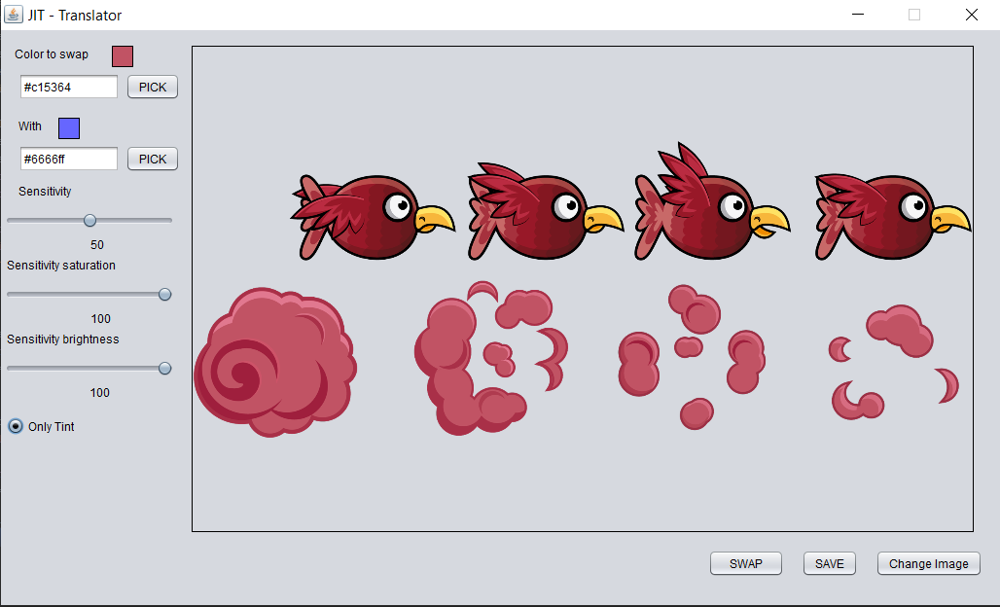
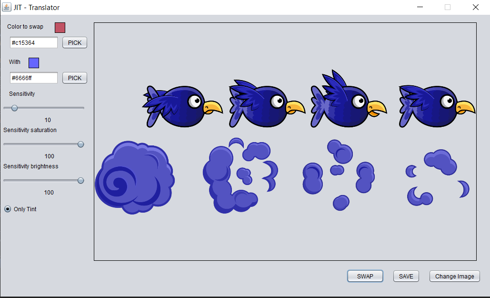
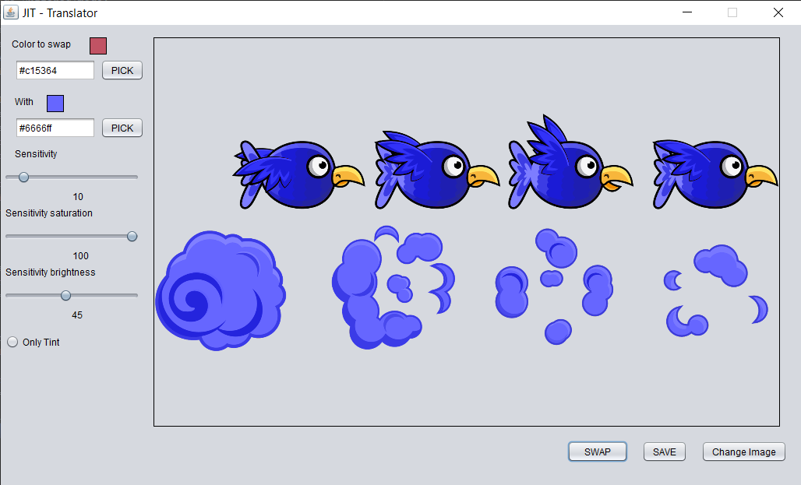

# Swap Color

## About
This is a little project i've done to swap color in an image. It's based on HSV color which is closer to human perception than RGB.
Here is the original image:

Here is the image when we change only the hue value (its tint), we only work on this hue value, the saturation and the brightness is the same than in the image.

Here is the change with the 3 parameter adjusted and with the same color, we calculate a new saturation and brightness based on the difference between the color of the original image  and the color to swap.

## Features
- You can pick the color to swap by clicking on the image
- You can select multiple files and apply the changes to all of them
- You can save the result in a directorty, if the file already exist we change the name to a new one
